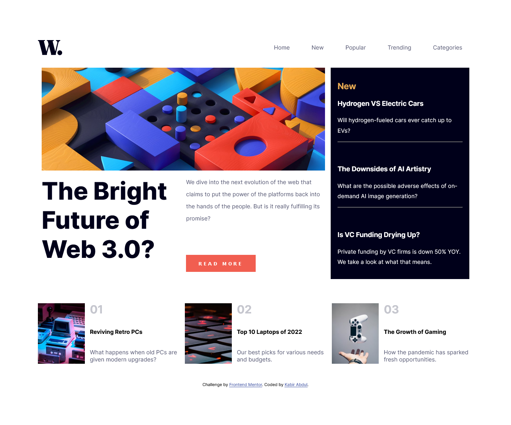
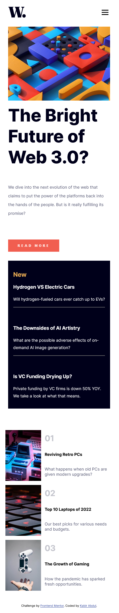
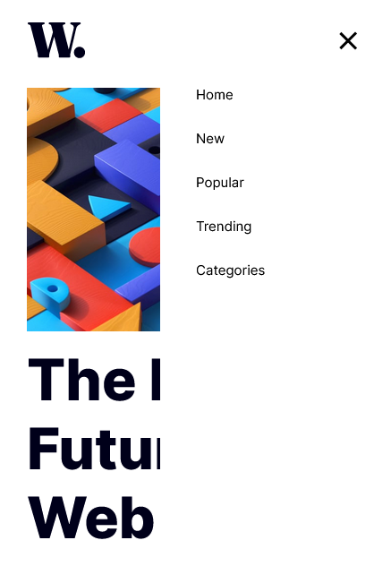

# Frontend Mentor - News homepage solution

This is a solution to the [News homepage challenge on Frontend Mentor](https://www.frontendmentor.io/challenges/news-homepage-H6SWTa1MFl). Frontend Mentor challenges help you improve your coding skills by building realistic projects. 

## Table of contents

  - [The challenge](#the-challenge)
  - [Screenshot](#screenshot)
  - [Links](#links)
- [My process](#my-process)
  - [Built with](#built-with)
  - [What I learned](#what-i-learned)
  - [Continued development](#continued-development)
  - [Useful resources](#useful-resources)
- [Author](#author)
- [Acknowledgments](#acknowledgments)

### The challenge

Users should be able to:

- View the optimal layout for the interface depending on their device's screen size
- See hover and focus states for all interactive elements on the page
- **Bonus**: Toggle the mobile menu (requires some JavaScript)

### Screenshots for dektop and mobile view

### Links

- Solution URL: [Click here](https://github.com/Kb-Jr/News-Homepage.git)
- Live Site URL: [Click here](https://kb-jr.github.io/News-Homepage/)

## My process

This project was split into 3 parts; The NAvigation bar, the main body and the footer. The Navigation bar contained the Logo and navigation links. The main body had an image, an aside and two articles. The foot section had 3 articles. The layout for all 3 parts were implemented using CSS grid and CSS flexbox was used in combination to help with the alignment and spacing of elements within the different parts. A single Media query was used to specify how the design should appear on smaller devices.

Some CSS animations and Javascript were used to implement the responsive navigation menu. This was done partly by specifying rules to toggle between the display at different screen sizes.

### Built with

- Semantic HTML5 markup
- CSS custom properties
- Flexbox
- CSS Grid
- Javascript
- Desktop-first workflow

### What I learned

In this project i was able to practice using some semantic HTML5 tags, some css animation properties and using Javascript functions.

### Useful resources

- [CSS Grid Layout Crash Course By Brad Traversy](https://www.youtube.com/watch?v=jV8B24rSN5o) - This resource helped me get a grasp of the basic concepts of using CSS grid for building layouts.

- [Build a Responsive Grid CSS Website Layout From Scratch](https://www.youtube.com/watch?v=moBhzSC455o) - This resource provided more insights into CSS grid. It was particularly helpful in demonstrating the utilization of CSS Grib by building a project.

- [Responsive Navigation Bar Tutorial | HTML CSS JAVASCRIPT](https://www.youtube.com/watch?v=gXkqy0b4M5g) - This video helped me build the responsive navigation menu.

## Author

- Frontend Mentor - [@Kb-Jr](https://www.frontendmentor.io/profile/Kb-Jr)
- Twitter - [@Joker__XL](https://www.twitter.com/yourusername)

## Acknowledgments
Appreciation goes to [Brad Traversy](https://github.com/bradtraversy), [Simo Edwin](https://github.com/developedbyed) and [w3schools](https://www.w3schools.com/).

